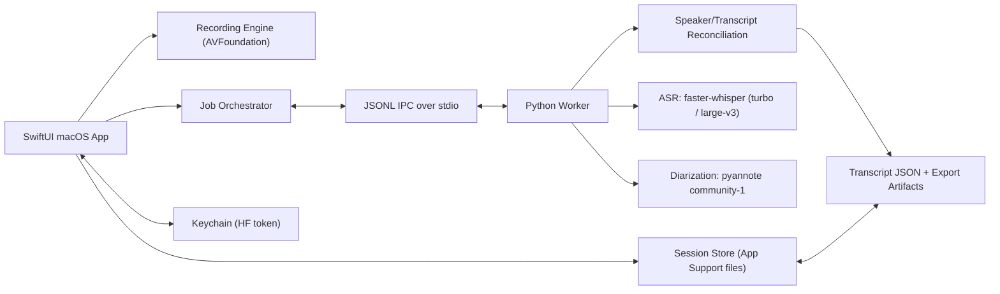

# Project Architecture

## Architecture Overview

### Summary
Greenfield macOS desktop app with a native SwiftUI UI and a local Python ML worker process.

- **App process (SwiftUI + AVFoundation)** handles:
- microphone permission + recording
- session library UI and transcript editing/export UX
- local file storage and job orchestration
- progress/error presentation
- preferences and credentials orchestration (HF token via Keychain)
- **Worker process (Python)** handles:
- Whisper-family transcription (`faster-whisper`) with timestamps
- speaker diarization (`pyannote.audio` / `community-1`)
- transcript/speaker reconciliation
- export artifact generation (optional in worker or app)

### Why this architecture
- Keeps the **macOS UX native and responsive**
- Uses the most practical **best-practice diarization stack** (Whisper + pyannote) without forcing Python into the UI layer
- Allows later replacement of the ASR backend (e.g., MLX/WhisperKit) behind a stable worker contract
- Reduces risk from previous failed attempts by isolating ML/runtime complexity to one process

### High-level component diagram


## Constraints from projectplan.md

### Requirements that drive design
- Local-first macOS app (Apple Silicon target)
- Whisper-family models with support for large models (`large-v3`) and a fast option (`turbo`)
- Speaker-labeled transcript output (generic speakers are acceptable)
- Post-session processing is acceptable for v1 (not real-time diarized captions)
- Strong error handling for permission/model/auth/setup failures
- Offline processing after setup/model installation

### Scope clarifications used for this architecture (pending PO doc sync)
- **Language support in v1**: Dutch (`nl`) and English (`en`) transcription only
- **Translation**: disabled (`task=transcribe` only)
- **Audio capture in v1**: microphone-only (no system/loopback capture)

## Technology Stack

### macOS App (primary UI/client)
- **Language**: Swift
- **UI**: SwiftUI (macOS)
- **Audio capture**: AVFoundation (`AVAudioEngine` preferred for control; `AVAudioRecorder` acceptable for first milestone)
- **Concurrency**: Swift Concurrency (`async/await`, `Task`)
- **Local storage**: File-based session store using JSON (`Codable`) + WAV audio files
- **Credentials**: Keychain Services (Hugging Face token, if required for pyannote model access)
- **Logging**: Unified Logging (`os.Logger`) + local structured log files for processing jobs

### ML Worker (local processing)
- **Runtime**: Python 3.11/3.12 (pinned and isolated virtual environment)
- **ASR**: `faster-whisper`
- **Diarization**: `pyannote.audio` (`community-1`)
- **Audio I/O / transforms**: `soundfile` / `torchaudio` (avoid external `ffmpeg` dependency for v1 recording path)
- **IPC**: JSON Lines over `stdin/stdout`
- **Packaging strategy (v1)**: sidecar worker environment managed by the app installer/bootstrap (not embedded in Swift process)

### Why not alternatives (v1)
- **WhisperKit / MLX / whisper.cpp**: strong Apple Silicon options, but `pyannote` diarization still pulls us toward Python. We keep a backend abstraction so ASR can be swapped later if performance warrants.
- **WhisperX full alignment pipeline**: excellent reference, but adds alignment model complexity. V1 uses `faster-whisper` timestamps and a deterministic reconciliation pipeline first.
- **SQLite-first persistence**: useful later, but file-based session directories reduce early migration and debugging overhead in a greenfield app.

## Data Models

### Storage layout (App Support)
Per-session directory pattern:

```text
~/Library/Application Support/<BundleID>/sessions/<sessionId>/
  manifest.json
  audio/
    source.wav
  processing/
    request.json
    worker.log
    metrics.json
  transcript/
    transcript.json
    transcript.txt
    transcript.srt
```

Global app files:

```text
~/Library/Application Support/<BundleID>/
  settings.json
  models/
    (local model caches or pointers if external cache is used)
  logs/
```

### Core entities (app-side `Codable`)

#### `SessionManifest`
- `id: UUID`
- `createdAt: Date`
- `updatedAt: Date`
- `title: String` (default generated, editable later)
- `recordingState: enum { idle, recording, stopped }`
- `processingState: enum { not_started, queued, running, completed, failed, cancelled }`
- `processingStage: enum? { preparing, transcribing, diarizing, reconciling, exporting }`
- `durationMs: Int`
- `audioFileRelativePath: String`
- `languageMode: enum { auto, nl, en }`
- `profile: enum { fast, best }`
- `modelConfig: ModelConfigSnapshot`
- `speakerCountHint: SpeakerCountHint?` (optional min/max)
- `artifactStatus: ArtifactStatus`
- `lastError: ProcessingError?`

#### `TranscriptDocument`
- `schemaVersion: Int`
- `sessionId: UUID`
- `createdAt: Date`
- `updatedAt: Date`
- `sourceLanguage: String?`
- `transcriptionBackend: BackendInfo`
- `diarizationBackend: BackendInfo`
- `speakers: [Speaker]`
- `segments: [TranscriptSegment]`
- `stats: TranscriptStats`

#### `Speaker`
- `id: String` (stable logical ID, e.g. `spk_1`)
- `defaultLabel: String` (e.g. `Speaker 1`)
- `displayName: String?` (user rename)
- `colorHex: String`
- `isUserEdited: Bool`

#### `TranscriptSegment`
- `id: String`
- `startMs: Int`
- `endMs: Int`
- `speakerId: String?`
- `text: String`
- `confidence: Double?` (aggregate confidence heuristic)
- `speakerConfidence: Double?`
- `source: enum { machine, user_edited }`
- `words: [WordToken]?` (optional in v1 if enabled)

#### `WordToken` (optional in v1 but supported by schema)
- `startMs: Int`
- `endMs: Int`
- `text: String`
- `probability: Double?`
- `speakerId: String?`

### Worker request/response models

#### `TranscriptionJobRequest`
- `jobId: UUID`
- `sessionId: UUID`
- `audioPath: String`
- `outputDir: String`
- `languageMode: auto | nl | en`
- `profile: fast | best`
- `asrModel: String` (`turbo` or `large-v3`)
- `diarizationEnabled: Bool`
- `speakerHints: { min?: Int, max?: Int }`
- `wordTimestamps: Bool`

#### `TranscriptionJobResult`
- `jobId`
- `status: completed | failed | cancelled`
- `transcriptPath`
- `metricsPath`
- `detectedLanguage`
- `warnings: [String]`
- `error?: WorkerError`

### Versioning strategy
- `schemaVersion` on transcript JSON and manifest JSON
- Worker reports `pipelineVersion` and library versions in metadata for debugging regressions
- Backward-compatible readers in the app (ignore unknown fields)

## API Design

This project has no network API in v1. The primary interface contract is a local IPC protocol between the Swift app and Python worker.

### IPC transport
- **Transport**: `stdin/stdout` JSONL (one JSON object per line)
- **Process ownership**: App launches worker process on demand and supervises lifecycle
- **Cancellation**: App sends `cancel_job`; worker cooperatively cancels current job

### Message envelope
```json
{
  "type": "request|event|response|error",
  "requestId": "uuid",
  "command": "health_check",
  "payload": {}
}
```

### Required commands
- `health_check`
- `get_capabilities` (models/profiles available, versions)
- `validate_setup` (pyannote token/model availability, write permissions)
- `run_transcription_job`
- `cancel_job`

### Event stream (progress)
- `job_started`
- `job_progress` with:
- `stage` (`preparing|transcribing|diarizing|reconciling|writing_output`)
- `progress` (`0.0 - 1.0`, best-effort)
- `message`
- `job_warning`
- `job_completed`
- `job_failed`

### Error taxonomy (app-visible)
- `MIC_PERMISSION_DENIED`
- `AUDIO_DEVICE_UNAVAILABLE`
- `WORKER_LAUNCH_FAILED`
- `PYTHON_ENV_MISSING`
- `MODEL_NOT_INSTALLED`
- `MODEL_DOWNLOAD_FAILED`
- `DIARIZATION_AUTH_REQUIRED`
- `DIARIZATION_MODEL_UNAVAILABLE`
- `PROCESSING_TIMEOUT`
- `INSUFFICIENT_DISK_SPACE`
- `UNKNOWN_PROCESSING_ERROR`

## Processing Pipeline Design

### Recording path (v1)
1. App requests microphone permission.
2. App records microphone audio to local WAV (`source.wav`).
3. App finalizes session manifest and queues processing.

### Transcription + diarization pipeline (worker)
1. **Preflight**
- Validate job payload and audio path
- Validate model/profile selection
- Validate diarization model/token readiness (if diarization enabled)
2. **Transcription**
- Run `faster-whisper` with `task=transcribe`
- Profiles:
- `fast` => `turbo`
- `best` => `large-v3`
- `word_timestamps=True`
- `vad_filter=True` (default on for v1)
- `language`:
- `None` for auto
- `"nl"` or `"en"` if user selected
3. **Diarization**
- Run `pyannote` `community-1`
- Use speaker count hints if provided
- Prefer exclusive diarization output (when available) for reconciliation
4. **Reconciliation**
- Assign speaker to words by timeline overlap
- Assign segment speaker by majority overlap / weighted duration
- Mark low-confidence speaker assignment when overlap is ambiguous
5. **Output generation**
- Write `transcript.json`
- Optionally write derived `txt`/`srt` (or defer to app exporter)
- Write `metrics.json` (durations by stage, model names, warnings)

### Reconciliation rules (deterministic v1)
- If a word overlaps multiple speaker turns, choose max-overlap speaker
- If a segment has no assigned words, choose the speaker with max overlap over segment span
- If overlap ratio is below threshold, set `speakerId = null` and flag for review
- Preserve worker raw diarization turns in metadata for debugging (optional)

## UI / UX Architecture (v1)

### Screens
- **Session List / Home**
- New recording
- Previous sessions and processing status
- **Recording Screen**
- Elapsed timer, audio level indicator, stop control
- **Processing State View**
- Stage progress and actionable errors
- **Transcript Editor**
- Timestamped segments list
- Speaker badge and rename flow
- Inline text editing
- Export action
- **Settings**
- Model profile defaults (`Fast` / `Best`)
- Language mode default (`Auto`, `Dutch`, `English`)
- Diarization setup status (token/model)

### State management boundaries
- `SessionStore`: local manifests + transcript load/save
- `RecordingController`: AVFoundation lifecycle
- `ProcessingCoordinator`: queue + worker IPC + retries
- `TranscriptEditorViewModel`: in-memory edits + persistence

## Security & Privacy Design

### Privacy defaults
- Audio and transcripts remain local by default
- No automatic cloud uploads
- Clear user-facing notice if a one-time external model download is required

### Secrets handling
- Store Hugging Face token in Keychain (never plaintext in JSON files)
- Redact tokens from logs

### Local data handling
- Store artifacts under app-specific Application Support directory
- Provide future delete-session workflow that removes audio and transcript artifacts together

## Non-Functional Requirements

### Performance / responsiveness
- UI remains responsive during processing (worker runs out-of-process)
- Progress updates at stage level minimum
- Large model processing may be slow; app must not block the main thread

### Reliability / recoverability
- Persist job state in `manifest.json`
- On app restart, detect `running` jobs and mark as `failed` or `interrupted` with retry option
- Worker crash should surface a structured error and preserve logs

### Observability
- Per-job metrics (`metrics.json`) including stage durations and selected model
- Structured logs on both app and worker sides

### Distribution assumptions
- Initial distribution is **outside the Mac App Store** (Developer ID + notarization) to reduce sandboxing/runtime restrictions while packaging local ML dependencies

## Implementation Strategy

### Phase 1: Thin vertical slice (prove end-to-end)
- Record mic audio
- Save session locally
- Launch worker
- Run transcription only (`turbo`) on Dutch/English audio
- Render transcript segments in app

### Phase 2: Add speaker diarization + editing
- Integrate pyannote pipeline
- Reconcile speaker labels onto segments/words
- Add transcript editor (rename/reassign/edit)

### Phase 3: Hardening and onboarding
- Setup validation, model management, token onboarding, retries
- Export formats, metrics, improved errors
- Packaging/notarization strategy

### Key architectural tradeoffs
- **Two-process over single-process embedded ML**: more moving parts, but clearer failure boundaries and easier debugging
- **File-based persistence over DB**: simpler initial implementation, less query power
- **faster-whisper over native-only ASR (v1)**: easier diarization integration, potentially slower on Apple Silicon vs MLX/WhisperKit

## Risks and Mitigations

- **Python environment brittleness**
- Mitigation: pin dependencies, provide `validate_setup`, capture `get_capabilities`, and isolate worker behind IPC contract

- **Diarization quality issues (overlap/backchannels)**
- Mitigation: explicit UX for rename/reassign, low-confidence flags, generic speaker labels, clear v1 expectations

- **Slow processing with `large-v3`**
- Mitigation: default profile `Fast` (`turbo`), show stage progress, keep `Best` as opt-in

- **Model/token onboarding friction**
- Mitigation: first-run checklist UI + setup validation + actionable error messages + Keychain token storage

- **App/worker schema drift**
- Mitigation: versioned JSON schemas and integration tests using fixture transcripts
