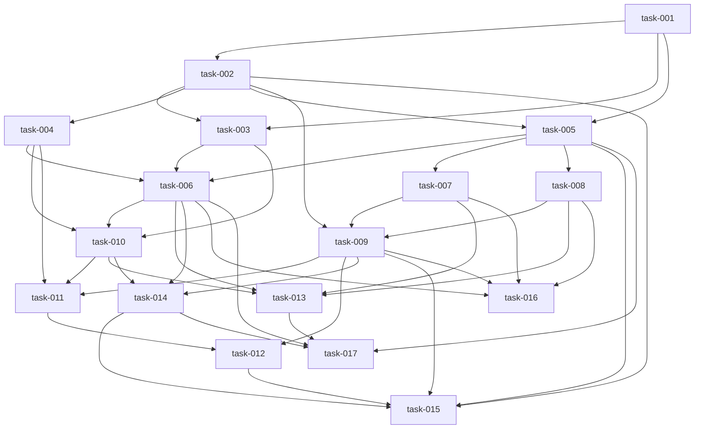

# Task Breakdown

## Task: task-001
- **Title**: Bootstrap repository structure and development toolchains
- **Description**: Create the greenfield project skeleton with a macOS SwiftUI app target, a Python worker folder, shared docs/contracts folder, and baseline README/setup scripts. Establish pinned tool versions and local dev commands.
- **Priority**: 10
- **Dependencies**: []
- **Estimated Complexity**: medium
- **Agent**: coder
- **Parallelizable**: no
- **Handoff Notes**: Prefer a simple top-level structure (e.g., `app/`, `worker/`, `docs/`, `fixtures/`, `scripts/`). Include a `worker/requirements.txt` (or equivalent lock flow) and a minimal Swift app that launches.
- **Verification Notes**: Confirm the Swift app launches on macOS and the worker environment can be created successfully with a health-check script entry point.

## Task: task-002
- **Title**: Define shared file layout and JSON contracts
- **Description**: Define and document `manifest.json`, `transcript.json`, and worker IPC payload schemas with versioned examples. Implement app-side `Codable` models and worker-side dataclasses/pydantic models (or typed dicts).
- **Priority**: 10
- **Dependencies**: [task-001]
- **Estimated Complexity**: medium
- **Agent**: coder
- **Parallelizable**: yes
- **Handoff Notes**: Keep schema version fields explicit and reserve optional fields for future word-level metadata and confidence. Add at least one fixture transcript JSON for integration tests.
- **Verification Notes**: Round-trip encode/decode in Swift and Python for sample payloads; fail cleanly on missing required fields.

## Task: task-003
- **Title**: Implement microphone permission and recording engine
- **Description**: Build the macOS microphone capture flow (permission request, start/stop recording, elapsed timer, error states) and persist recorded audio to session folders as WAV.
- **Priority**: 10
- **Dependencies**: [task-001, task-002]
- **Estimated Complexity**: high
- **Agent**: coder
- **Parallelizable**: no
- **Handoff Notes**: Start with microphone-only capture. Prefer robust file finalization on stop/cancel and clear error mapping for permission denial and device unavailability.
- **Verification Notes**: Manual test on macOS: first-launch permission prompt, record/stop path, resulting WAV exists and duration is non-zero.

## Task: task-004
- **Title**: Build session store and local persistence repository
- **Description**: Implement file-based session storage for manifests, transcript artifacts, and status updates. Add APIs to list sessions, read details, and persist edits safely.
- **Priority**: 9
- **Dependencies**: [task-002]
- **Estimated Complexity**: medium
- **Agent**: coder
- **Parallelizable**: yes
- **Handoff Notes**: Use atomic writes for JSON updates to reduce corruption risk. Define recovery behavior for incomplete sessions and interrupted writes.
- **Verification Notes**: Unit tests for create/list/update session manifests and loading malformed/missing files with safe fallback errors.

## Task: task-005
- **Title**: Implement Python worker scaffold and JSONL IPC protocol
- **Description**: Create the worker process entry point, JSONL message loop, command routing (`health_check`, `get_capabilities`, `validate_setup`, `run_transcription_job`, `cancel_job`), and structured progress/error events.
- **Priority**: 10
- **Dependencies**: [task-001, task-002]
- **Estimated Complexity**: medium
- **Agent**: coder
- **Parallelizable**: yes
- **Handoff Notes**: Keep the command loop testable without actual ML loads. Define stable error codes early; the app UI will depend on them.
- **Verification Notes**: Integration test the worker with stdin/stdout fixtures for successful `health_check` and a simulated job progress sequence.

## Task: task-006
- **Title**: Add app-side processing coordinator and worker supervision
- **Description**: Implement the Swift-side job queue/orchestrator that spawns the worker, submits jobs, consumes progress events, updates session status, supports retry, and maps worker errors to UI-facing states.
- **Priority**: 10
- **Dependencies**: [task-003, task-004, task-005]
- **Estimated Complexity**: high
- **Agent**: coder
- **Parallelizable**: no
- **Handoff Notes**: Ensure worker I/O runs off the main thread and job state transitions are explicit and persisted to `manifest.json`.
- **Verification Notes**: Simulate worker progress and failure responses; verify UI/session states transition correctly and are restored after app restart.

## Task: task-007
- **Title**: Integrate Whisper ASR backend (`faster-whisper`) with profiles
- **Description**: Implement transcription in the worker using `faster-whisper` with `fast` (`turbo`) and `best` (`large-v3`) profiles, Dutch/English/auto language modes, timestamps, and VAD filtering.
- **Priority**: 10
- **Dependencies**: [task-005]
- **Estimated Complexity**: high
- **Agent**: coder
- **Parallelizable**: yes
- **Handoff Notes**: Expose selected model/profile and detected language in worker result metadata. Keep `task=transcribe` fixed (no translation path in v1).
- **Verification Notes**: Run against short Dutch and English fixtures; verify transcript output exists and language/profile metadata matches expectations.

## Task: task-008
- **Title**: Integrate speaker diarization with pyannote (`community-1`)
- **Description**: Add diarization support in the worker using pyannote, including setup validation, optional speaker count hints, and retrieval of diarization turns suitable for transcript reconciliation.
- **Priority**: 10
- **Dependencies**: [task-005]
- **Estimated Complexity**: high
- **Agent**: coder
- **Parallelizable**: yes
- **Handoff Notes**: Separate setup/auth errors from runtime diarization errors. Persist raw diarization metadata (or a normalized form) for debugging.
- **Verification Notes**: Validate setup command behavior for missing token/model vs ready state; run diarization on a fixture and confirm turns are produced.

## Task: task-009
- **Title**: Implement transcript-speaker reconciliation and transcript JSON writer
- **Description**: Merge ASR timestamps with diarization turns into the canonical `transcript.json` format, assign segment/word speaker labels, and flag low-confidence assignments.
- **Priority**: 10
- **Dependencies**: [task-002, task-007, task-008]
- **Estimated Complexity**: high
- **Agent**: coder
- **Parallelizable**: no
- **Handoff Notes**: Make reconciliation deterministic and unit-testable with synthetic overlap cases (clean overlap, ambiguous overlap, no overlap).
- **Verification Notes**: Unit tests cover speaker assignment rules and ensure stable transcript JSON generation for fixed inputs.

## Task: task-010
- **Title**: Build session list, recording, and processing-state UI
- **Description**: Implement the primary app screens for session library/home, recording controls, and processing status/progress/error presentation.
- **Priority**: 9
- **Dependencies**: [task-003, task-004, task-006]
- **Estimated Complexity**: medium
- **Agent**: coder
- **Parallelizable**: yes
- **Handoff Notes**: Focus on clear status communication and recovery actions (retry/open settings) rather than visual polish.
- **Verification Notes**: Manual UI walkthrough covering first run, record/stop, queued/running/completed/failed states.

## Task: task-011
- **Title**: Build transcript editor with speaker rename and segment reassignment
- **Description**: Implement transcript review/edit UI with timestamped segments, inline text editing, speaker badges, global speaker rename, and per-segment speaker reassignment persisted to local storage.
- **Priority**: 10
- **Dependencies**: [task-004, task-009, task-010]
- **Estimated Complexity**: high
- **Agent**: coder
- **Parallelizable**: no
- **Handoff Notes**: Preserve original machine text/metadata where possible so future “revert segment” is feasible, even if hidden in v1.
- **Verification Notes**: Manual and unit tests confirm edits persist, speaker renames propagate to all segments, and re-opened sessions retain changes.

## Task: task-012
- **Title**: Implement transcript exports (`txt`, `srt`, `json`)
- **Description**: Add export generation and save flow for plain text, SRT, and canonical JSON transcript formats, preserving speaker labels and timestamps where supported.
- **Priority**: 8
- **Dependencies**: [task-009, task-011]
- **Estimated Complexity**: medium
- **Agent**: coder
- **Parallelizable**: yes
- **Handoff Notes**: Decide single source of truth for export generation (app vs worker) and keep formatting deterministic for tests.
- **Verification Notes**: Snapshot tests or golden-file comparisons for exported `txt`/`srt`/`json` outputs from a known transcript fixture.

## Task: task-013
- **Title**: Add setup/onboarding for models, profiles, and diarization readiness
- **Description**: Implement settings and first-run setup checks for worker availability, model/profile readiness, diarization token/model status, and actionable guidance to resolve missing prerequisites.
- **Priority**: 9
- **Dependencies**: [task-006, task-007, task-008, task-010]
- **Estimated Complexity**: high
- **Agent**: coder
- **Parallelizable**: yes
- **Handoff Notes**: Store secrets in Keychain only. Provide a `validate_setup` pathway the UI can call without starting a full transcription job.
- **Verification Notes**: Manual tests for ready state, missing token, missing model, and broken worker env with clear user-facing messages.

## Task: task-014
- **Title**: Harden error handling, cancellation, and interrupted-job recovery
- **Description**: Implement cancellation flow, interrupted-job detection on app restart, log surfacing, and consistent error mapping across recording and processing paths.
- **Priority**: 9
- **Dependencies**: [task-006, task-009, task-010]
- **Estimated Complexity**: medium
- **Agent**: coder
- **Parallelizable**: yes
- **Handoff Notes**: Define a single app-side error presentation model to avoid fragmented strings and inconsistent recovery actions.
- **Verification Notes**: Kill worker mid-job and restart app; verify session becomes recoverable with retry and logs preserved.

## Task: task-015
- **Title**: Add automated tests and fixture coverage for app/worker contracts
- **Description**: Build a regression test suite covering schema compatibility, worker IPC protocol, reconciliation logic, export formatting, and critical session-store operations with Dutch/English fixtures.
- **Priority**: 8
- **Dependencies**: [task-002, task-005, task-009, task-012, task-014]
- **Estimated Complexity**: high
- **Agent**: tester
- **Parallelizable**: yes
- **Handoff Notes**: Prioritize deterministic tests around contracts and transforms; keep heavy ML inference out of CI by using mocked/stubbed worker outputs for most cases.
- **Verification Notes**: CI/local test command runs green; failing fixture changes produce actionable diffs.

## Task: task-016
- **Title**: Add performance metrics and dogfooding benchmark workflow
- **Description**: Capture stage timings, chosen model/profile, and completion outcomes per session, then provide a simple benchmark/report path for comparing `turbo` vs `large-v3` on target hardware.
- **Priority**: 7
- **Dependencies**: [task-006, task-007, task-008, task-009]
- **Estimated Complexity**: medium
- **Agent**: coder
- **Parallelizable**: yes
- **Handoff Notes**: Keep metrics local and privacy-preserving. Emit one `metrics.json` per session and optionally a small aggregation script.
- **Verification Notes**: Run two sample sessions (fast/best) and confirm metrics files record stage durations and model identifiers.

## Task: task-017
- **Title**: Package sidecar worker and prepare macOS distribution (Developer ID/notarization)
- **Description**: Define and implement packaging for the Swift app plus Python worker environment, including startup path resolution, first-run setup, and notarization-ready build outputs for non-App-Store distribution.
- **Priority**: 6
- **Dependencies**: [task-001, task-005, task-006, task-013, task-014]
- **Estimated Complexity**: high
- **Agent**: coder
- **Parallelizable**: no
- **Handoff Notes**: Treat packaging as a separate milestone; keep dev workflow unblocked while this is in progress. Document known platform restrictions and signing implications.
- **Verification Notes**: Build a distributable app on a clean macOS machine/user profile and confirm worker health check and a sample transcription job run.

## Dependency Graph

